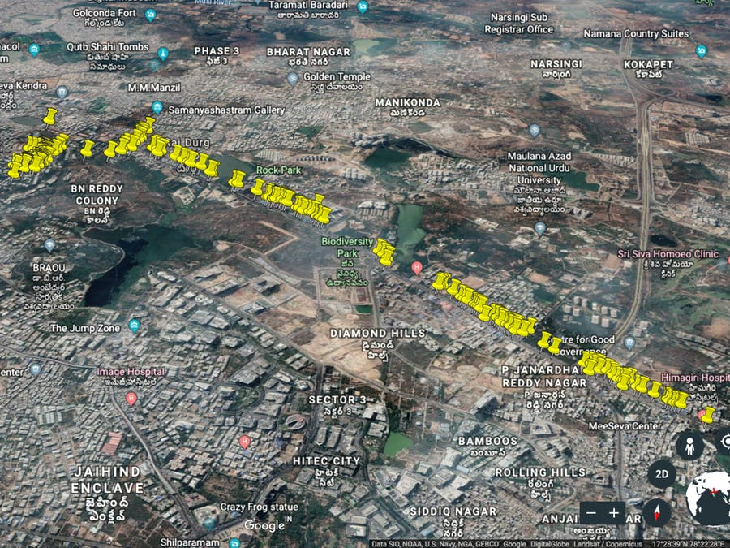

# location-tracker
A simple Location Tracking Device using Nodemcu and WiFi Geolocation API.

# Getting Started
## Below are the things you need to get started
* A NodeMCU ESP8266 Breakout Board
* API token with Unwired Labs WiFi Geolocation API
* A tool to plot your data on a map

## Here is an example of my Location data when plotted on google earth
